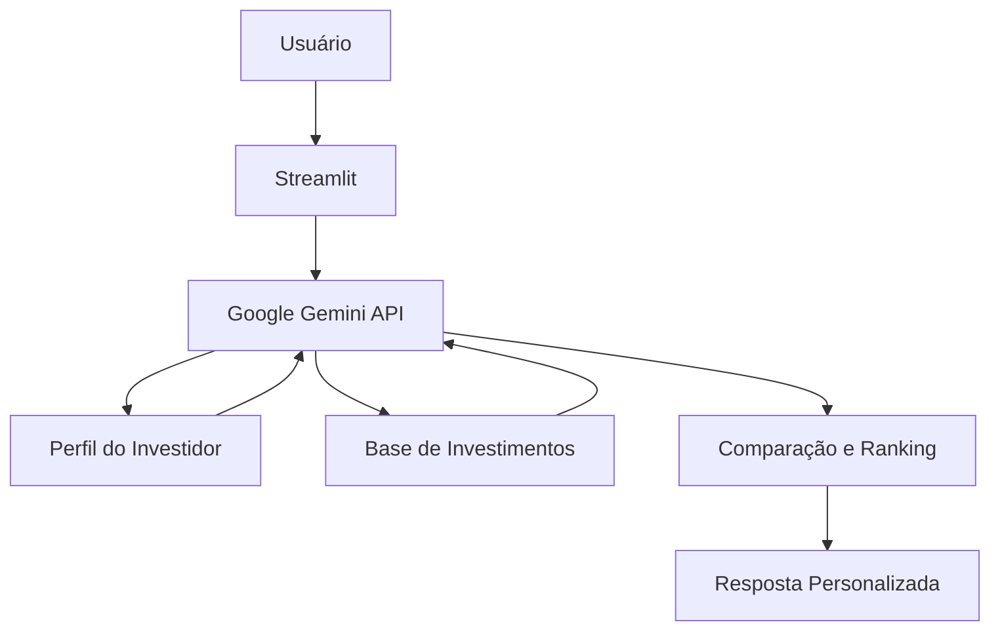

# 💰 InvesteAI - Assistente Inteligente de Investimentos

> Agente de IA Generativa que analisa opções de investimento e ajuda a identificar as alternativas mais adequadas ao perfil, objetivos e preferências do investidor.

## 💡 O Que é o InvesteAI?

O InvesteAI é um assistente financeiro que **compara e analisa investimentos** disponíveis em uma base de conhecimento, considerando fatores como perfil de risco, rentabilidade, liquidez, prazo e objetivo financeiro.

A proposta é facilitar a comparação entre diferentes alternativas e apresentar ao usuário quais investimentos são mais compatíveis com suas necessidades, explicando de forma simples os critérios utilizados na análise.

**O que o InvesteAI faz:**

* ✅ Identifica o perfil e os objetivos do investidor
* ✅ Compara investimentos disponíveis na base de conhecimento
* ✅ Analisa critérios como risco, rentabilidade, liquidez e prazo
* ✅ Ranqueia as opções mais compatíveis com o perfil do cliente
* ✅ Explica os motivos por trás de cada sugestão
* ✅ Apresenta vantagens e limitações de cada alternativa
* ✅ Utiliza apenas informações disponíveis na base de conhecimento

**O que o InvesteAI NÃO faz:**

* ❌ Não inventa produtos, taxas ou rentabilidades
* ❌ Não garante retorno financeiro
* ❌ Não recomenda produtos que não estejam cadastrados na base
* ❌ Não acessa dados bancários reais ou informações sensíveis
* ❌ Não executa aplicações financeiras
* ❌ Não substitui um profissional certificado

## 🏗️ Arquitetura



O agente recebe a necessidade do usuário e consulta sua base de conhecimento para identificar:

* Perfil de risco
* Objetivo financeiro
* Horizonte de investimento
* Necessidade de liquidez
* Produtos financeiros disponíveis

Com essas informações, compara as alternativas disponíveis e apresenta os investimentos mais compatíveis, acompanhados de uma justificativa.

**Stack:**

* Interface: Streamlit
* LLM: Google Gemini
* Integração com IA: Gemini API
* Dados: JSON/CSV mockados
* Linguagem: Python
* Execução: Google Colab ou Streamlit Community Cloud

## 📁 Estrutura do Projeto

```text
├── data/                          # Base de conhecimento
│   ├── perfil_investidor.json     # Perfil e objetivos do cliente
│   ├── transacoes.csv             # Histórico financeiro
│   ├── historico_atendimento.csv  # Interações anteriores
│   └── produtos_financeiros.json  # Investimentos disponíveis
│
├── docs/                          # Documentação completa
│   ├── 01-documentacao-agente.md  # Caso de uso, persona e arquitetura
│   ├── 02-base-conhecimento.md    # Estratégia e estrutura dos dados
│   ├── 03-prompts.md              # System prompt e exemplos
│   ├── 04-metricas.md             # Avaliação de qualidade
│   └── 05-pitch.md                # Apresentação do projeto
│
└── src/
    └── app.py                     # Aplicação Streamlit
```

## 🚀 Como Executar

O projeto utiliza uma API de IA Generativa hospedada na nuvem, portanto não é necessário baixar ou executar um modelo de linguagem no computador.

### 1. Obter uma chave da Gemini API

Crie uma chave de API no Google AI Studio e armazene-a como variável de ambiente:

```text
GEMINI_API_KEY=sua_chave_aqui
```

> Nunca publique sua chave de API diretamente no código ou no GitHub.

### 2. Instalar as Dependências

Em um ambiente online como Google Colab, Codespaces ou Streamlit Community Cloud:

```bash
pip install streamlit pandas google-genai
```

### 3. Executar a Aplicação

```bash
streamlit run src/app.py
```

A aplicação também pode ser publicada no Streamlit Community Cloud, permitindo que o agente seja acessado diretamente pelo navegador.

## 🌐 Execução na Nuvem

Uma das propostas do projeto é permitir que todo o desenvolvimento e execução sejam feitos pela internet.

Uma possível estrutura é:

```text
GitHub
   │
   ▼
Streamlit Community Cloud
   │
   ├── Interface Streamlit
   ├── Base JSON/CSV
   │
   ▼
Google Gemini API
   │
   ▼
Resposta do InvesteAI
```

Dessa forma, não é necessário manter um modelo de IA rodando localmente.

## 🎯 Exemplo de Uso

**Pergunta:**
"Tenho perfil conservador e quero investir R$ 10.000 por dois anos. Quais são as melhores opções disponíveis?"

**InvesteAI:**
"Considerando seu perfil conservador, prazo de dois anos e os investimentos disponíveis na base, as opções mais compatíveis são aquelas que apresentam menor risco e prazo adequado ao seu objetivo.

Entre as alternativas disponíveis, eu destacaria:

1. CDB — baixo risco e rentabilidade compatível com seu perfil.
2. Tesouro Selic — alta liquidez e baixo risco.
3. LCI — pode ser interessante pela isenção de Imposto de Renda, dependendo das condições disponíveis na base.

Posso comparar essas três opções em rentabilidade, liquidez e risco para você."

---

**Pergunta:**
"Qual desses investimentos tem maior liquidez?"

**InvesteAI:**
"Entre as opções cadastradas, o Tesouro Selic apresenta maior facilidade de resgate. O CDB e a LCI podem possuir regras específicas de vencimento ou carência.

Se a possibilidade de utilizar o dinheiro antes do prazo for importante para você, a liquidez deve receber um peso maior na comparação."

## 🧠 Como o Agente Escolhe os Investimentos?

O InvesteAI não considera automaticamente o investimento com maior rentabilidade como sendo o melhor.

A análise leva em consideração diferentes características:

| Critério            | O que representa                                  |
| ------------------- | ------------------------------------------------- |
| **Perfil de risco** | Quanto risco o investidor está disposto a assumir |
| **Rentabilidade**   | Potencial de retorno do investimento              |
| **Liquidez**        | Facilidade e prazo para recuperar o dinheiro      |
| **Prazo**           | Tempo recomendado para permanecer no investimento |
| **Objetivo**        | Finalidade do dinheiro investido                  |
| **Compatibilidade** | Adequação do produto às necessidades do cliente   |

A partir desses critérios, o agente compara os produtos cadastrados e apresenta as alternativas mais compatíveis.

## 🛡️ Segurança e Anti-Alucinação

Como decisões financeiras exigem informações confiáveis, o InvesteAI segue algumas regras:

* Utiliza somente produtos existentes na base de conhecimento
* Não inventa taxas, rentabilidades ou características
* Informa quando um dado necessário não está disponível
* Não promete retornos futuros
* Diferencia informações objetivas de estimativas
* Explica os critérios utilizados na comparação
* Solicita informações adicionais quando o perfil ou objetivo não estiver claro

Caso não existam dados suficientes para realizar uma comparação segura, o agente deve informar essa limitação ao usuário.

## 📊 Métricas de Avaliação

| Métrica              | Objetivo                                                                   |
| -------------------- | -------------------------------------------------------------------------- |
| **Assertividade**    | O agente responde corretamente ao que foi solicitado?                      |
| **Segurança**        | Evita inventar produtos, dados ou rentabilidades?                          |
| **Coerência**        | As sugestões são compatíveis com o perfil do investidor?                   |
| **Explicabilidade**  | O agente explica os motivos das sugestões?                                 |
| **Aderência à base** | As respostas utilizam apenas informações disponíveis nos dados fornecidos? |

## 🎬 Diferenciais

* **Comparação Inteligente:** Analisa diferentes investimentos simultaneamente
* **Personalização:** Considera perfil, objetivos, prazo e necessidade de liquidez
* **Explicabilidade:** Mostra os motivos pelos quais cada opção foi selecionada
* **Execução Online:** Pode ser desenvolvido e executado sem instalar um modelo de IA localmente
* **IA Generativa na Nuvem:** Utiliza a API do Google Gemini
* **Anti-alucinação:** Limita as respostas às informações da base de conhecimento
* **Apoio à decisão:** Organiza e compara alternativas de forma objetiva

## 🎯 Objetivo do Projeto

O objetivo do InvesteAI é reduzir a dificuldade de comparar diferentes alternativas de investimento.

Em vez de exigir que o usuário analise individualmente risco, rentabilidade, prazo e liquidez de cada produto, o agente organiza essas informações e apresenta as opções mais compatíveis com suas necessidades.

O resultado esperado é uma experiência de análise de investimentos mais simples, personalizada e transparente.

## 📝 Documentação Completa

Toda a documentação técnica, arquitetura, estratégia de dados, engenharia de prompts, métricas e casos de teste está disponível na pasta [`docs/`](./docs/).

> Este projeto foi desenvolvido como protótipo educacional utilizando dados fictícios e não representa recomendação financeira real.
