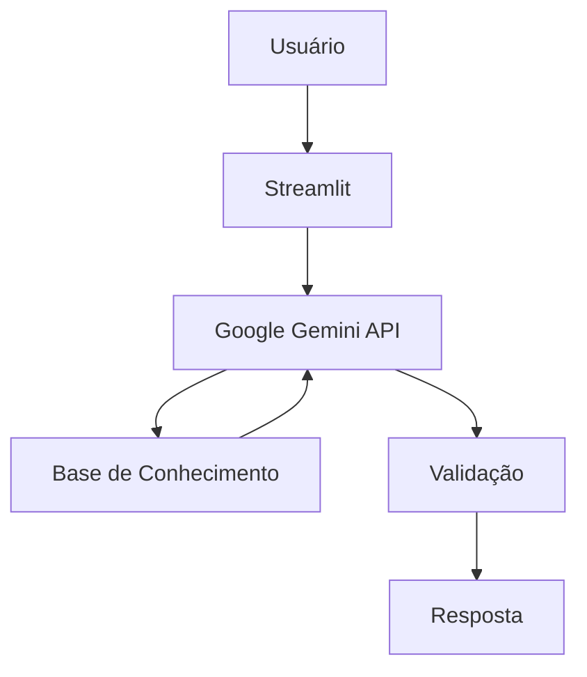

# Documentação do Agente

## Caso de Uso

### Problema

Escolher investimentos pode ser difícil por envolver risco, rentabilidade, prazo e liquidez.

### Solução

O InvesteAI compara os investimentos disponíveis e indica os mais compatíveis com o perfil, objetivos e necessidades do usuário.

### Público-Alvo

Pessoas que querem investir melhor, mas precisam de ajuda para comparar opções.

---

## Persona e Tom de Voz

### Nome do Agente

**InvesteAI**

### Personalidade

Consultivo, direto e educativo.

### Tom de Comunicação

Claro, acessível e profissional.

### Exemplos de Linguagem

* Saudação: "Olá! Posso ajudar você a comparar as melhores opções de investimento."
* Confirmação: "Entendi! Vou analisar as opções disponíveis para o seu perfil."
* Erro/Limitação: "Não encontrei essa informação na base de conhecimento."

---

## Arquitetura

### Diagrama

### Componentes

| Componente           | Descrição                                               |
| -------------------- | ------------------------------------------------------- |
| Interface            | Chatbot em Streamlit                                    |
| LLM                  | Google Gemini via API                                   |
| Base de Conhecimento | JSON/CSV com perfil, produtos, transações e histórico   |
| Validação            | Confere se a resposta está baseada nos dados fornecidos |

---

## Segurança e Anti-Alucinação

### Estratégias Adotadas

* [x] Usa apenas produtos cadastrados na base
* [x] Não inventa taxas ou rentabilidades
* [x] Admite quando não possui informação
* [x] Considera o perfil do investidor antes de sugerir opções
* [x] Não promete retorno financeiro
* [x] Sinaliza dados contraditórios

### Limitações Declaradas

O agente:

* Não garante rentabilidade;
* Não executa investimentos;
* Não acessa contas bancárias reais;
* Não consulta dados de mercado em tempo real;
* Não substitui um profissional financeiro;
* Não recomenda produtos fora da base cadastrada.

> O InvesteAI é um protótipo educacional e não representa recomendação financeira profissional.
